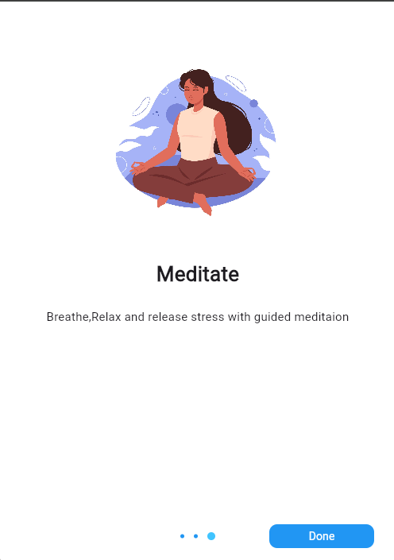
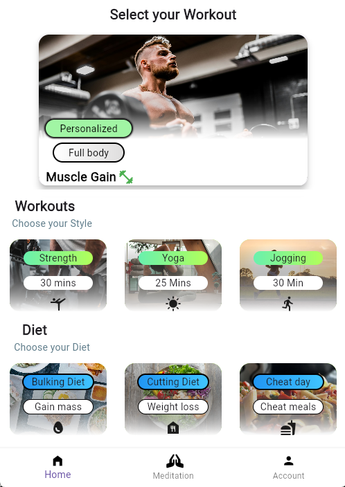
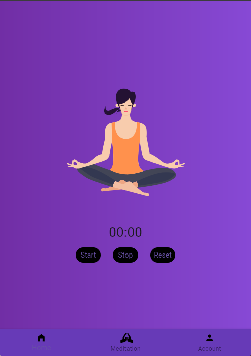
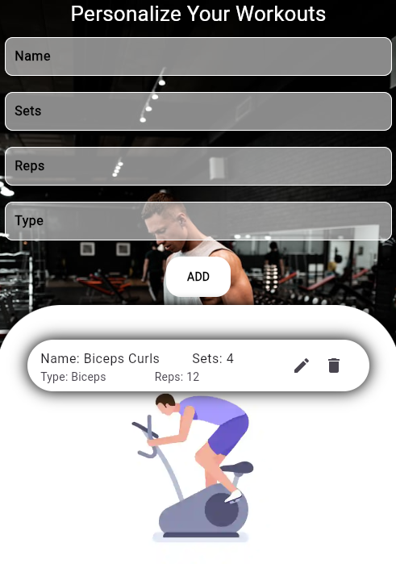
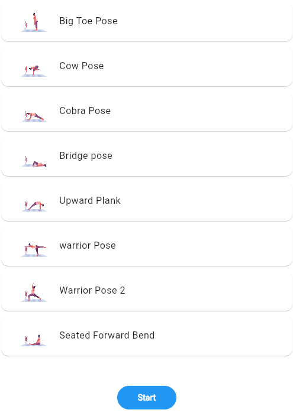
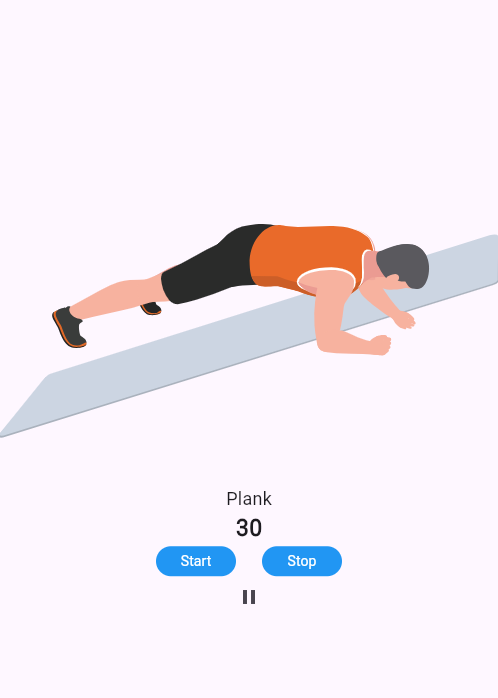
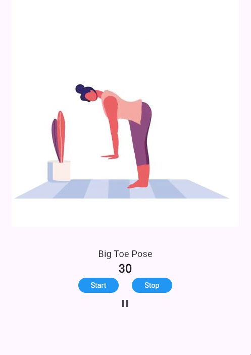
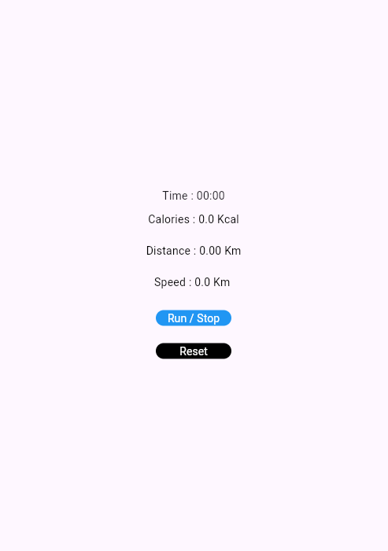

# fitnesshive

A new Flutter project.

## Getting Started

This project is a starting point for a Flutter application.

A few resources to get you started if this is your first Flutter project:

- [Lab: Write your first Flutter app](https://docs.flutter.dev/get-started/codelab)
- [Cookbook: Useful Flutter samples](https://docs.flutter.dev/cookbook)

For help getting started with Flutter development, view the
[online documentation](https://docs.flutter.dev/), which offers tutorials,
samples, guidance on mobile development, and a full API reference.

### discription
fitJourney is an simple minimalistic fitness app with strength training,yoga,meditation with relaxing music and diets.It have features like personalization of your workouts with hive and meditation with ambient music.

## Features
- Strength training
- Yoga 
- Personalization of your own wrkout plans
- Mediation with ambient music and animation
- Diets for cutting,bulking and cheat meal
- Jogging

## App features
- hive
- Audioplayer
- Animations

## Screenshots

